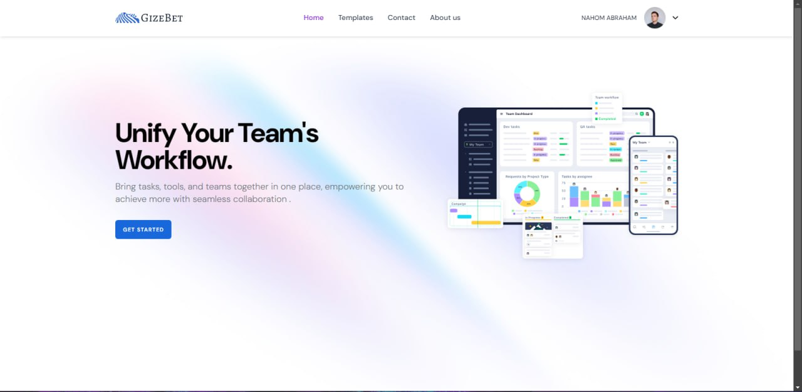
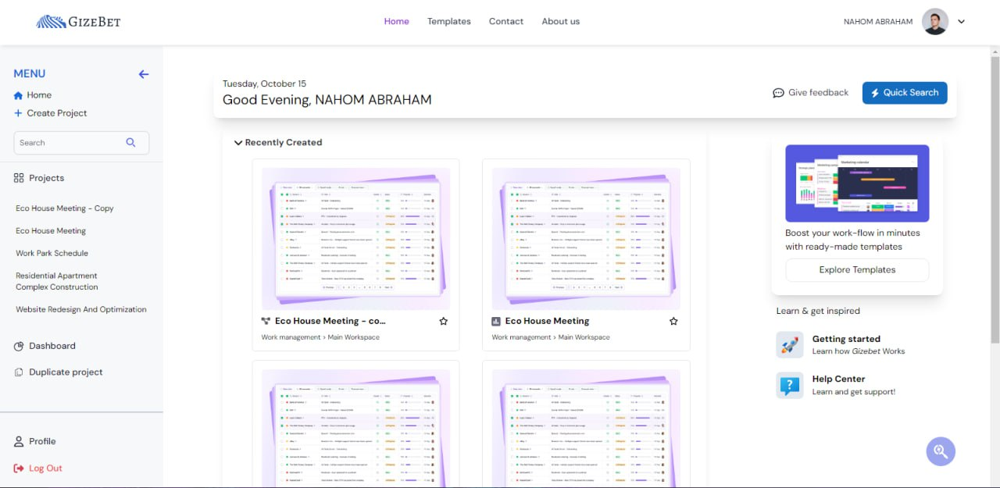
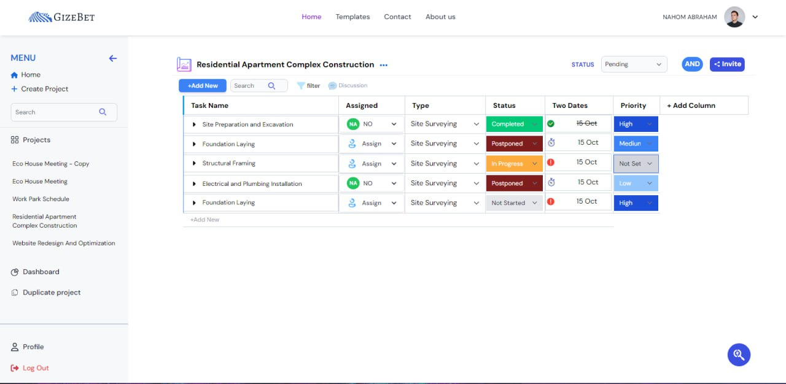
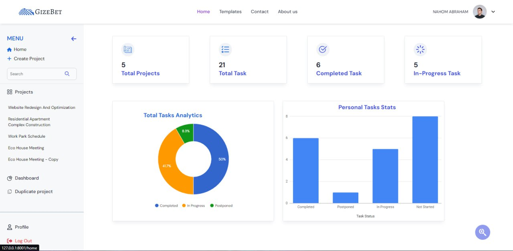
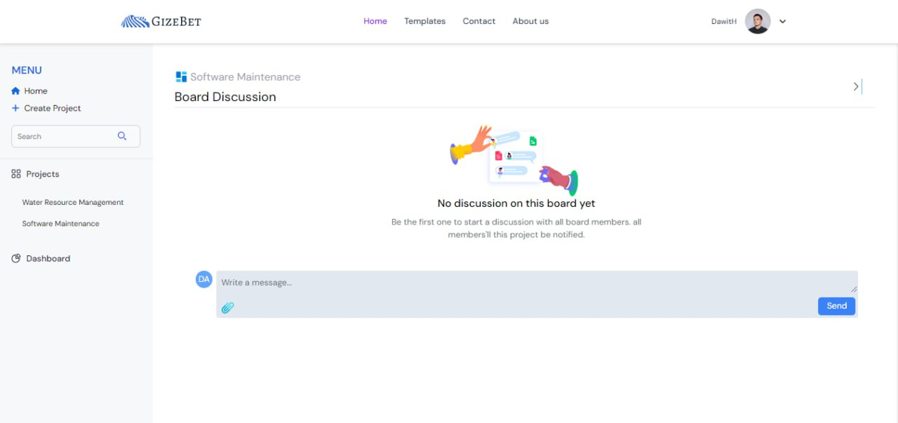

# Gizebet Project Management Platform - README

## Overview
**Gizebet** is a comprehensive project management platform designed to streamline and optimize project management activities for teams across various industries. With its powerful features for task management, progress tracking, team collaboration, resource allocation, and project planning, Gizebet is an all-in-one solution for improving productivity and efficiency in managing projects, whether you're working with small teams or large enterprises.

This platform offers flexibility, scalability, and an intuitive user experience to help you organize and manage projects seamlessly, ensuring successful project delivery within deadlines and budget.
### 1. **Landing Page**

Below is the landing page of the Gizebet Project Management System:



### 2. **Home Page**
The Home Page is the central hub where you can access all projects and tasks. Here's a screenshot of the home page:




### 3. **Project Show Page**
The Project Show page allows you to view detailed information about a specific project. Here's a screenshot of this page:



---

### 4. **Project Dashboard**
The **Project Dashboard** displays key metrics related to project tasks, providing an overview of task completion and project progress. It includes the total number of tasks, completed tasks, and in-progress tasks. Visualizations such as a pie chart and bar graph give a clear view of task distribution and project status.



---

### 5. **Discussion Page**
The **Discussion Page** allows team members to have conversations regarding a specific project, task, or topic. It includes features like comments, file sharing, and notifications to facilitate seamless collaboration. Here's a screenshot of the discussion page:



---
## Features

### 1. **Task Management**
   - Assign tasks to team members with deadlines and priorities.
   - Track task progress in real-time and set task dependencies.
   - Add task descriptions, tags, comments, and attachments for context.

### 2. **Progress Tracking**
   - Visual dashboards, Gantt charts, and progress reports to track project milestones.
   - Monitor team performance and task completion.
   - Generate detailed reports on overall project status.

### 3. **Resource Allocation**
   - Track and manage resource availability and utilization.
   - Forecast future resource needs and optimize allocation for efficiency.
   - Budget tracking for ensuring cost-effective project execution.

### 4. **Team Collaboration**
   - Real-time communication tools including in-app chat and direct messaging.
   - File sharing and collaboration on documents.
   - Integration with third-party communication tools (e.g., Slack, MS Teams).

### 5. **Project Planning and Timelines**
   - Tools for detailed project planning, timeline creation, and workflow mapping.
   - Set task dependencies and timelines to optimize task execution.
   - Risk and contingency planning for managing uncertainties.

### 6. **User Roles and Permissions**
   - Customizable user roles to define project access and responsibilities.
   - Secure access control to protect sensitive data.
   - Full audit trails to track user actions and ensure accountability.

### 7. **Document Management**
   - Centralized document storage with version control.
   - Easy access to project documents and important files.

### 8. **Customization and Scalability**
   - Highly customizable workflows, dashboards, and project views.
   - Scalable to support small teams or large enterprises with growing needs.
   - Adaptable to various industries and project management methodologies.

## Installation

### Prerequisites
- PHP >= 7.4
- Laravel >= 8.x
- Node.js >= 12.x
- MySQL/MariaDB
- Composer
- NPM/Yarn

### Steps to Install

1. **Clone the Repository**:
   ```bash
   git clone https://github.com/your-username/gizebet-project-management.git
   ```

2. **Navigate to the Project Directory**:
   ```bash
   cd gizebet-project-management
   ```

3. **Install Backend Dependencies**:
   ```bash
   composer install
   ```

4. **Install Frontend Dependencies**:
   ```bash
   npm install
   ```

5. **Environment Setup**:
   - Copy the `.env.example` file to `.env` and configure your environment variables:
   ```bash
   cp .env.example .env
   ```
   - Set up your database connection, mail configuration, and other settings.

6. **Generate Application Key**:
   ```bash
   php artisan key:generate
   ```

7. **Run Database Migrations**:
   ```bash
   php artisan migrate
   ```

8. **Run Database Seeding (Optional)**:
   ```bash
   php artisan db:seed
   ```

9. **Compile Frontend Assets**:
   ```bash
   npm run dev
   ```

10. **Start the Development Server**:
    ```bash
    php artisan serve
    ```

11. **Access the Platform**:
    - Open your browser and visit:
    ```
    http://localhost:8000
    ```

## Usage

### Logging In
- To log in, use your registered email and password..

### Managing Projects
- Create a new project, assign tasks to team members, set deadlines, and track project milestones.
- Use the dashboard to get a bird’s eye view of all active projects, resource usage, and timelines.

### Collaboration
- Use the integrated chat feature for team communication or share project-related documents directly through the platform.

### Reporting
- Generate detailed reports on task completion, resource allocation, and overall project progress for management review.

## Contribution
Feel free to fork the repository and contribute to the development of Gizebet. Contributions in the form of bug fixes, feature requests, or improvements are welcome.

 

## Contact
For any questions or support, please contact the Gizebet team at **gizebetofficial@gmail.com**.

---

Thank you for using **Gizebet**! We hope it helps make your project management tasks more efficient and streamlined.
